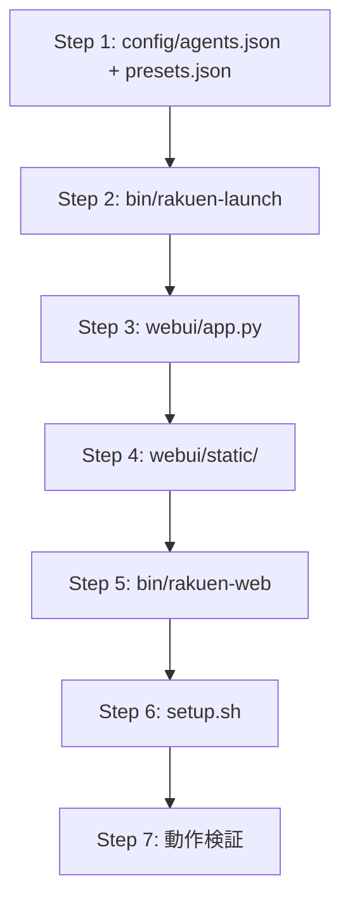

# 実装計画書: rakuen-web システム v1

> 基準仕様: [specv1.md](specv1.md)
> 参考実装: `sanko/multi-agent-rakuen-main/`
> 作成日: 2026-01-30

---

## 1. スコープ

`specv1.md` に定義された rakuen-web システムを実装する.
WSL上で `rakuen-web` コマンドを実行するだけで, tmux マルチエージェント環境と Web UI を起動する.

### 1.1 実装対象

| # | コンポーネント | ファイル | 言語 |
|---|-------------|---------|------|
| 1 | エントリポイント | `bin/rakuen-web` | bash |
| 2 | tmux構築 | `bin/rakuen-launch` | bash |
| 3 | HTTPサーバ | `webui/app.py` | Python |
| 4 | Web UI | `webui/static/{index.html, app.js, style.css}` | HTML/JS/CSS |
| 5 | エージェント定義 | `config/agents.json` | JSON |
| 6 | プリセット定義 | `config/presets.json` | JSON |
| 7 | デプロイ | `setup.sh` | bash |

### 1.2 スコープ外

- 認証/外部公開/マルチユーザ
- WebSocket/SSE (ポーリングのみ)
- systemd等のプロセス監視
- エージェントプロンプト内容の最適化

---

## 2. ディレクトリ構成

### 2.1 リポジトリ内 (開発)

```
Multi-Agent-Codingv2/
  rakuen/
    bin/
      rakuen-web            # PATH入口
      rakuen-launch         # tmux構築 (B-1方式)
    webui/
      app.py                # HTTPサーバ (tmuxブリッジ)
      requirements.txt      # Python依存 (標準ライブラリのみ)
      static/
        index.html          # SPA
        app.js              # フロントエンドロジック
        style.css           # スタイル
    config/
      agents.json           # pane定義 (必須)
      presets.json          # プリセットボタン定義
    prompts/                # システムプロンプト配置先 (空)
      .gitkeep
    setup.sh                # デプロイスクリプト
```

### 2.2 デプロイ先 (運用)

```
/home/<user>/rakuen/
  bin/                      # setup.sh がコピー
  webui/
  config/
  prompts/
  .venv/                    # setup.sh が自動作成
  logs/                     # 実行時に自動作成
```

---

## 3. コンポーネント詳細設計

### 3.1 bin/rakuen-web (エントリポイント)

**責務**: WSL判定, repo root決定, tmux構築委譲, WebUI起動

```
起動フロー:
  1. WSL判定
     - /proc/version に "microsoft" を含む OR $WSL_INTEROP が存在
     - 不合格: エラーメッセージ出力 → exit 1
  2. RAKUEN_HOME 決定
     - /home/$USER/rakuen (固定)
  3. repo root 決定
     - git rev-parse --show-toplevel (成功時)
     - pwd (失敗時 fallback)
  4. rakuen-launch 呼び出し
     - REPO_ROOT を引数で渡す
     - --strict オプション転送 (任意)
  5. Python venv 確認/作成
     - $RAKUEN_HOME/.venv が無ければ python3 -m venv で作成
     - pip install -r requirements.txt (変更時のみ)
  6. app.py 起動
     - 環境変数: RAKUEN_HOME, REPO_ROOT
     - フォアグラウンド実行
```

**引数**:

- `--strict`: 検証失敗時に起動中止
- `--port <N>`: 開始ポート指定 (デフォルト: 8080)

### 3.2 bin/rakuen-launch (tmux構築 B-1)

**責務**: tmuxセッション構築 (冪等), 整合性検証

```
構築フロー:
  1. agents.json 読み込み
     - パス: $RAKUEN_HOME/config/agents.json
     - ${REPO_ROOT} をシェル変数で展開
  2. rakuen セッション
     - tmux has-session -t rakuen → 存在すれば skip
     - 新規: tmux new-session -d -s rakuen
     - pane title 設定: tmux select-pane -t rakuen:0.0 -T "UI-CHAN"
     - env export: tmux send-keys -t rakuen:0.0 "export RAKUEN_ROLE=uichan" Enter
     - env export: tmux send-keys -t rakuen:0.0 "export RAKUEN_REPO_ROOT=<path>" Enter
  3. multiagent セッション
     - tmux has-session -t multiagent → 存在すれば skip
     - 新規: tmux new-session -d -s multiagent
     - split-window x8 で 9 panes 生成
     - 各 pane に title + env + command 設定
  4. pane index 検証
     - tmux list-panes -t multiagent:0 -F '#{pane_index}'
     - 0..8 の連番であることを確認
  5. 整合性検証
     - タイトル検証: #{pane_title} vs agents.json の title
     - env検証: マーカー方式 (printf "__ENV__%s\n" "$RAKUEN_ROLE")
     - 結果を JSON で stdout に出力
```

**pane生成の安定性確保**:

```bash
# multiagent: 9 panes を確実に生成
tmux new-session -d -s multiagent
for i in $(seq 1 8); do
  tmux split-window -t multiagent:0
done
# tiled レイアウトで均等配置
tmux select-layout -t multiagent:0 tiled
```

**検証結果JSON形式**:

```json
{
  "valid": true,
  "errors": [],
  "sessions": {
    "rakuen": {"exists": true},
    "multiagent": {"exists": true, "pane_count": 9}
  },
  "panes": {
    "rakuen:0.0": {"title_ok": true, "env_ok": true},
    "multiagent:0.0": {"title_ok": true, "env_ok": true, "expected_title": "AI-CHAN"},
    ...
  }
}
```

### 3.3 webui/app.py (HTTPサーバ)

**責務**: API提供, 静的ファイル配信, tmuxブリッジ

**技術選択**: Python標準ライブラリのみ (`http.server`, `json`, `subprocess`, `urllib.parse`)

- 理由: 外部依存ゼロ, venv は形式的に用意するが pip install 不要

**エージェント→tmuxターゲット マッピング**:

```python
AGENT_MAP = {
    "uichan":    "rakuen:0.0",
    "aichan":    "multiagent:0.0",
    "kobito1":   "multiagent:0.1",
    "kobito2":   "multiagent:0.2",
    "kobito3":   "multiagent:0.3",
    "kobito4":   "multiagent:0.4",
    "kobito5":   "multiagent:0.5",
    "kobito6":   "multiagent:0.6",
    "kobito7":   "multiagent:0.7",
    "kobito8":   "multiagent:0.8",
}
```

**API実装詳細**:

| エンドポイント | 処理 |
|-------------|------|
| `GET /api/health` | `{"ok": true}` を返却 |
| `GET /api/status` | `rakuen-launch --verify-only` を実行し結果を返却. セッション存在確認 + pane検証結果 |
| `GET /api/pane` | `tmux capture-pane -t <target> -p -S -<lines>` で取得. agent パラメータを allowlist 照合, lines を 50..1000 にclamp (デフォルト300) |
| `POST /api/send` | JSON body から text を取得 (最大8KB). `tmux send-keys -t rakuen:0.0 -- "<text>" Enter` で送信. target は固定 |
| `GET /api/presets` | `$RAKUEN_HOME/config/presets.json` を読み込んで返却. ファイル不存在時は空配列 |

**ポート自動インクリメント**:

```python
for port in range(8080, 8100):
    try:
        server = HTTPServer(("127.0.0.1", port), handler)
        break
    except OSError:
        continue
else:
    sys.exit("ERROR: No available port in 8080-8099")
```

### 3.4 Web UI (static/)

#### 3.4.1 index.html

**構成**:

```
+------------------------------------------------------+
| [Status Bar] tmux: OK | Validation: OK | Port: 8080  |
+----------+-------------------------------------------+
| [Agents] | [Log Area]                                |
| > UI-chan |                                           |
|   AI-chan |   <pre id="log">...</pre>                 |
|   Kobi-1 |                                           |
|   Kobi-2 |                                           |
|   ...    |                                           |
|   Kobi-8 |                                           |
+----------+-------------------------------------------+
| [Input]  [Send]  [Preset1] [Preset2] [Preset3] ...   |
+------------------------------------------------------+
```

#### 3.4.2 app.js

**主要機能**:

1. **ステータス取得**: 起動時に `/api/status` を1回取得, ステータスバーに表示
2. **ログポーリング**: 2秒間隔で `/api/pane?agent=<selected>&lines=300` を取得
3. **自動更新トグル**: ON/OFF切替ボタン (デフォルトON)
4. **エージェント切替**: クリックで選択エージェント変更, 即座にログ再取得
5. **コマンド送信**: 入力欄テキストを `POST /api/send` で送信 (ういちゃん選択時のみ有効)
6. **プリセット**: 起動時に `/api/presets` を取得, ボタン生成. クリックで即送信
7. **送信制限**: ういちゃん以外のエージェント選択時は入力欄+送信ボタン+プリセットを disabled

#### 3.4.3 style.css

- ダークテーマ (美少女テーマ: 黒背景 + 金アクセント)
- レスポンシブ (モバイル不要, デスクトップ最適化)
- ログ領域: monospace, 自動スクロール (最下部追従)
- エージェントリスト: ういちゃん=金, あいちゃん=赤, 小人=青

### 3.5 config/agents.json

```json
{
  "sessions": {
    "rakuen": {
      "window": 0,
      "panes": {
        "0": {
          "name": "uichan",
          "title": "UI-CHAN",
          "env": {
            "RAKUEN_ROLE": "uichan",
            "RAKUEN_REPO_ROOT": "${REPO_ROOT}"
          },
          "command": ""
        }
      }
    },
    "multiagent": {
      "window": 0,
      "panes": {
        "0": {"name": "aichan",  "title": "AI-CHAN", "env": {"RAKUEN_ROLE": "aichan",  "RAKUEN_REPO_ROOT": "${REPO_ROOT}"}, "command": ""},
        "1": {"name": "kobito1", "title": "KOBI-1", "env": {"RAKUEN_ROLE": "kobito1", "RAKUEN_REPO_ROOT": "${REPO_ROOT}"}, "command": ""},
        "2": {"name": "kobito2", "title": "KOBI-2", "env": {"RAKUEN_ROLE": "kobito2", "RAKUEN_REPO_ROOT": "${REPO_ROOT}"}, "command": ""},
        "3": {"name": "kobito3", "title": "KOBI-3", "env": {"RAKUEN_ROLE": "kobito3", "RAKUEN_REPO_ROOT": "${REPO_ROOT}"}, "command": ""},
        "4": {"name": "kobito4", "title": "KOBI-4", "env": {"RAKUEN_ROLE": "kobito4", "RAKUEN_REPO_ROOT": "${REPO_ROOT}"}, "command": ""},
        "5": {"name": "kobito5", "title": "KOBI-5", "env": {"RAKUEN_ROLE": "kobito5", "RAKUEN_REPO_ROOT": "${REPO_ROOT}"}, "command": ""},
        "6": {"name": "kobito6", "title": "KOBI-6", "env": {"RAKUEN_ROLE": "kobito6", "RAKUEN_REPO_ROOT": "${REPO_ROOT}"}, "command": ""},
        "7": {"name": "kobito7", "title": "KOBI-7", "env": {"RAKUEN_ROLE": "kobito7", "RAKUEN_REPO_ROOT": "${REPO_ROOT}"}, "command": ""},
        "8": {"name": "kobito8", "title": "KOBI-8", "env": {"RAKUEN_ROLE": "kobito8", "RAKUEN_REPO_ROOT": "${REPO_ROOT}"}, "command": ""}
      }
    }
  }
}
```

> `command` フィールドは空文字. 運用時にユーザが `claude -p "$(cat ...)"` 等を設定する.

### 3.6 config/presets.json

```json
{
  "presets": [
    {"id": "status",    "label": "状況報告",       "text": "現在の状況を報告せよ"},
    {"id": "dashboard", "label": "dashboard更新",  "text": "dashboard.mdを最新の状態に更新せよ"},
    {"id": "continue",  "label": "続行",           "text": "作業を続行せよ"},
    {"id": "stop",      "label": "停止",           "text": "現在の作業を中断し、状況を報告せよ"}
  ]
}
```

### 3.7 setup.sh (デプロイ)

```
デプロイフロー:
  1. コピー先確認
     - /home/$USER/rakuen/ が存在するか
     - 既存なら確認プロンプト (--force で skip)
  2. ファイルコピー
     - rsync or cp -r でリポジトリの rakuen/ を /home/$USER/rakuen/ へ
     - .venv, logs は除外 (既存保持)
  3. 実行権限付与
     - chmod +x bin/rakuen-web bin/rakuen-launch
  4. venv 作成
     - python3 -m venv /home/$USER/rakuen/.venv
  5. PATH設定
     - /home/$USER/rakuen/bin を PATH に追加 (.bashrc に追記)
     - 既存追記済みなら skip
  6. 確認
     - which rakuen-web で PATH解決確認
```

---

## 4. 整合性検証仕様

### 4.1 検証フェーズ

| # | 検証項目 | 方法 | 失敗時 |
|---|---------|------|--------|
| V1 | rakuenセッション存在 | `tmux has-session -t rakuen` | error追加 |
| V2 | multiagentセッション存在 | `tmux has-session -t multiagent` | error追加 |
| V3 | multiagent pane数 = 9 | `tmux list-panes -t multiagent:0 \| wc -l` | error追加 |
| V4 | pane index 0..8 連番 | `list-panes -F '#{pane_index}'` | error追加 |
| V5 | 各pane title一致 | `list-panes -F '#{pane_title}'` vs agents.json | warning追加 |
| V6 | 各pane env一致 | マーカー方式 (send-keys + capture-pane) | warning追加 |

### 4.2 env検証マーカー方式

```bash
# 検証実行
tmux send-keys -t multiagent:0.0 'printf "__ENV__%s\n" "$RAKUEN_ROLE"' Enter
sleep 0.5
tmux capture-pane -t multiagent:0.0 -p | grep '__ENV__' | tail -1
# → __ENV__aichan
```

### 4.3 検証結果の反映

- `valid: true` → UI上に緑バッジ表示
- `valid: false` → UI上に黄/赤警告バナー + エラー一覧
- `--strict` モード → `valid: false` で `rakuen-web` が exit 1

---

## 5. 技術的決定事項

| 項目 | 決定 | 理由 |
|------|------|------|
| HTTPサーバ | Python標準ライブラリ (`http.server`) | 外部依存ゼロ. WSL環境でpip不要 |
| JSON解析 (bash) | Python oneliner (`python3 -c "..."`) | jq非依存. Python3は必須要件 |
| フロントエンド | vanilla JS | ビルド不要. 単一ファイルで完結 |
| CSS | 手書き (フレームワークなし) | CDN依存なし. オフライン動作 |
| tmux操作 | 直接tmuxコマンド | 追加抽象化不要 |
| プロセス管理 | フォアグラウンド実行 | Ctrl+C で停止. systemd不要 |

---

## 6. 受け入れ基準チェックリスト

specv1.md セクション10 に対応:

| # | 基準 | 検証方法 |
|---|------|---------|
| AC1 | WSL以外で起動しない | Mac/Linux (非WSL) で `rakuen-web` → エラー終了 |
| AC2 | 任意ディレクトリで `rakuen-web` 実行 → UI起動 | `cd ~/p1/repo && rakuen-web` → ブラウザでアクセス可 |
| AC3 | repoに新規ファイル生成なし | `rakuen-web` 前後で `git status` に差分なし |
| AC4 | ういちゃん/あいちゃん/小人のログ閲覧 | UIでエージェント切替 → 各ログ表示 |
| AC5 | 送信はういちゃんのみ | あいちゃん/小人選択時 → 入力欄disabled |
| AC6 | ポート競合時に自動インクリメント | 8080占有時 → 8081で起動 |
| AC7 | 既存tmuxセッション非破壊 | 事前にrakuenセッション作成 → `rakuen-web` → セッション維持 |
| AC8 | pane title/env検証 → UI表示 | `/api/status` → valid + pane_meta 確認 |

---

## 7. 実装順序



1. **config/** - 先に定義を確定 (他コンポーネントが参照)
2. **bin/rakuen-launch** - tmux構築. 単体テスト可能
3. **webui/app.py** - API実装. tmux存在前提でテスト
4. **webui/static/** - UI実装. APIをモック/実接続でテスト
5. **bin/rakuen-web** - 全体統合. エントリポイント
6. **setup.sh** - デプロイ. 最後に作成
7. **動作検証** - 受け入れ基準チェック

---

## 8. リスクと対策

| リスク | 影響 | 対策 |
|--------|------|------|
| pane index ズレ | 全pane操作が破綻 | split後に必ず `list-panes` で確認. tiled レイアウトで安定化 |
| env検証でpane出力汚染 | ログにマーカーが残る | 仕様通り許容 (検証強度優先) |
| Python venv 作成失敗 | WebUI起動不可 | 標準ライブラリのみ使用のため, venv失敗時は直接実行にfallback |
| tmux未インストール | 全機能停止 | 起動時チェック + インストールガイド出力 |
| capture-pane 文字化け | ログ表示崩れ | UTF-8前提. `-e` オプションでエスケープシーケンス除去 |
